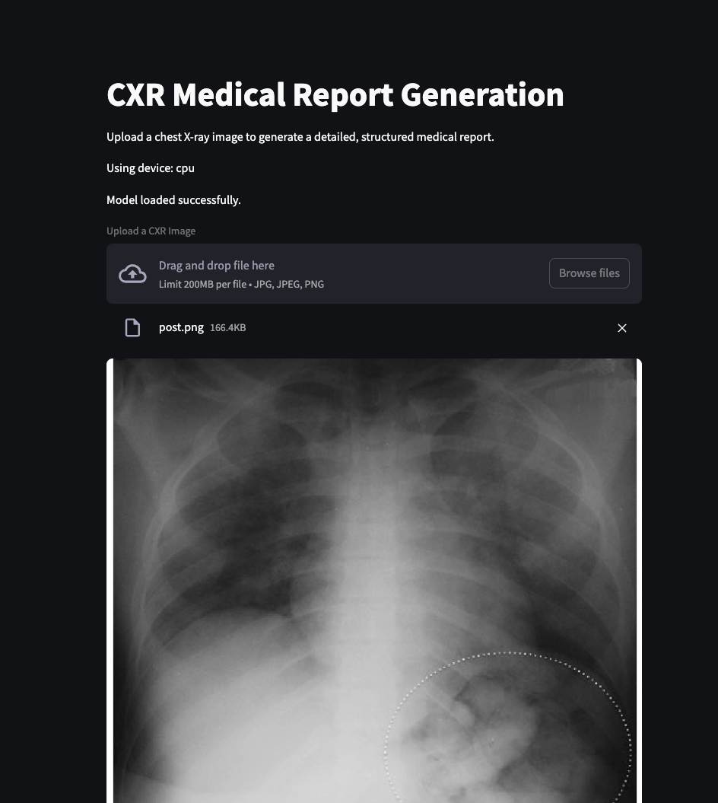
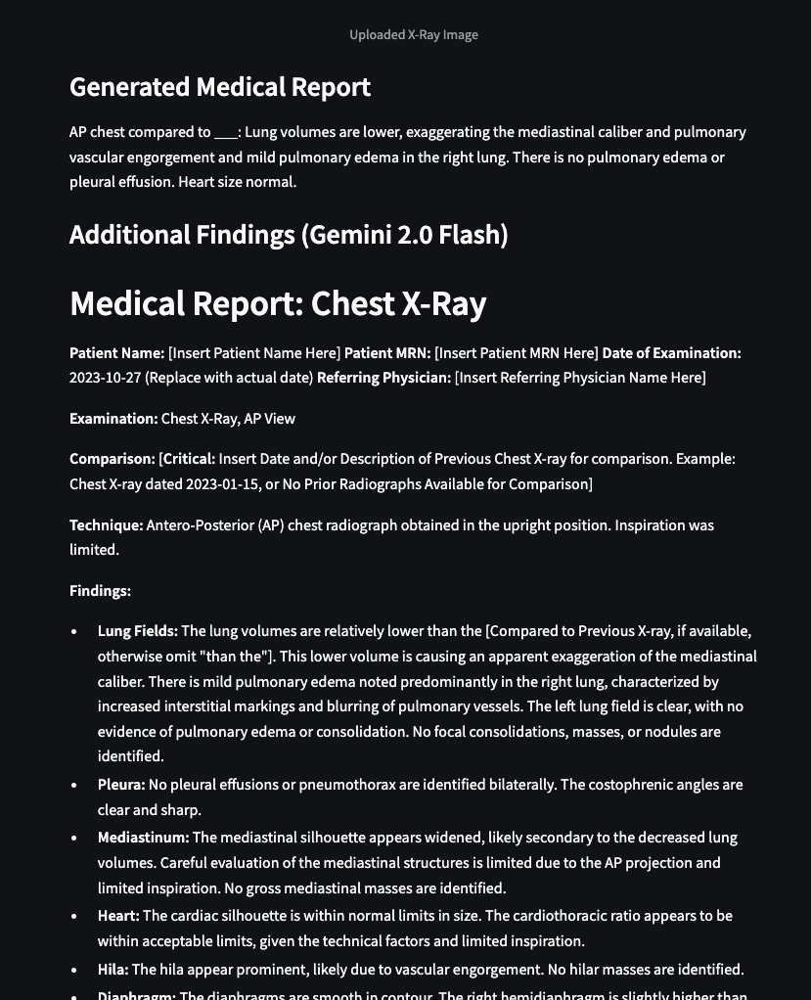

# Chest X-Ray Report Generation with AI

A deep learning system that automatically generates detailed medical reports from chest X-ray images, enhanced with advanced natural language capabilities via Google's Gemini 2.0 Flash API.



## Features

- **Automatic Report Generation**: Convert chest X-ray images into comprehensive text reports
- **Deep Learning Architecture**: ResNet-34 encoder + LSTM decoder for image-to-text generation
- **Report Enhancement**: Augmentation of initial reports using Gemini 2.0 Flash API
- **PDF Generation**: Creation of structured, professional medical reports
- **User-Friendly Interface**: Streamlit application for easy interaction
- **Medical Knowledge Incorporation**: Domain-specific vocabulary for radiological findings

## System Architecture

The system consists of two main components:

1. **Deep Learning Model**:
   - ResNet-34 encoder to extract visual features from chest X-ray images
   - LSTM decoder to generate descriptive reports from visual features
   - Custom vocabulary system specialized for medical terminology

2. **Inference Pipeline**:
   - Image preprocessing and feature extraction
   - Initial report generation
   - Report enhancement with Gemini 2.0 Flash
   - PDF report formatting and generation

## Installation

```bash
# Clone the repository
git clone https://github.com/yourusername/chest-xray-report-generation.git
cd chest-xray-report-generation

# Create a virtual environment
python -m venv venv
source venv/bin/activate  # On Windows: venv\Scripts\activate

# Install dependencies
pip install -r requirements.txt

# Set up Gemini API key
export GEMINI_API_KEY="your-api-key-here"
```

## Usage

### Running the Streamlit App

```bash
streamlit run inference_fullapp.py
```

### Using the Application

1. Upload a chest X-ray image through the web interface.
2. View the generated medical report.
3. See the enhanced report with additional details from Gemini.
4. Download a professionally formatted PDF report.

## Training the Model

The model was trained using the process detailed in `training.ipynb`, which includes:

- Dataset preparation and augmentation
- Vocabulary building for medical terminology
- Model training with cross-entropy loss
- Performance evaluation and visualization

## Directory Structure

```
├── inference_fullapp.py      # Streamlit application
├── models/                   # Pre-trained models and vocabulary
│   ├── cxr_report_generator.pth
│   └── vocab.pkl
├── requirements.txt          # Project dependencies
├── test_images/              # Sample X-ray images for testing
│   ├── pn.jpeg
│   └── post.png
└── training.ipynb            # Jupyter notebook for model training
```

## Technical Details

- **Model Architecture**: ResNet-34 encoder + LSTM decoder
- **Vocabulary**: Custom implementation with special tokens
- **Inference Process**: Greedy decoding with end-token detection
- **Image Preprocessing**: Normalization and resizing
- **PDF Generation**: FPDF library with customized medical report format
- **API Integration**: Google Generative AI SDK for Gemini 2.0 Flash

## Requirements

- Python 3.8+
- PyTorch 2.0.0+
- Streamlit 1.28.0+
- FPDF 1.7.2+
- Google Generative AI SDK 0.3.0+
- Additional dependencies in `requirements.txt`

## License

This project is licensed under the MIT License - see the `LICENSE` file for details.

## Disclaimer

This software is intended for research and development purposes only. It is not FDA-approved and should not be used for clinical diagnosis without proper validation and regulatory approval.

